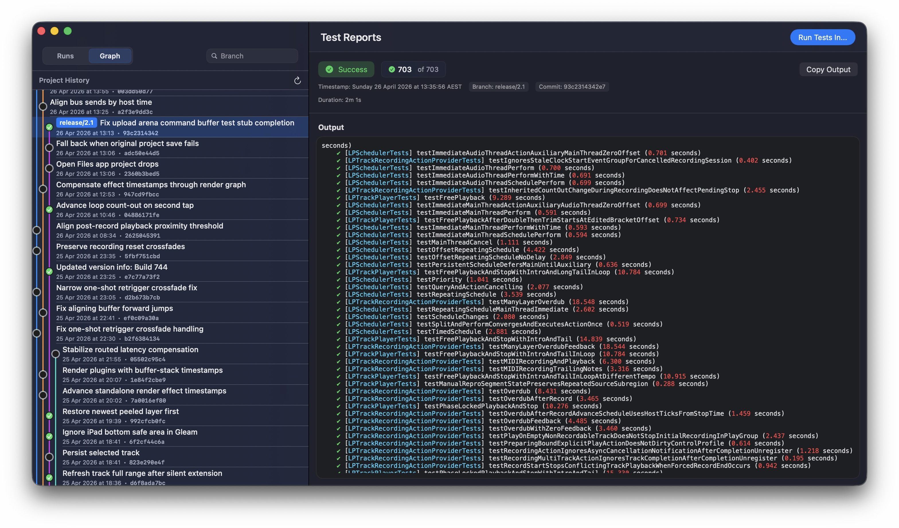

# Tests

Tests is a macOS menu bar app for keeping an eye on an Xcode test suite while you work on iOS and macOS apps. It was built as a local alternative to putting a project on GitHub just to use Apple's CI system: it runs on your Mac, stays visible in your workspace, and does not require any cloud services.



It watches a Git repository, runs tests in a disposable workspace, notifies you when a run fails, and gives you a compact reports window for recent runs and branch history. It is built for the workflow where commits are frequent, test runs take long enough to be annoying, and you want the result right there without babysitting Terminal or shipping your code somewhere else.

## Highlights

- Runs Xcode tests from a clean prepared workspace, separate from your working tree
- Runs locally in the background, with no hosted CI or cloud account required
- Can trigger automatically from a Git `post-commit` hook
- Shows live menu bar status while tests build and run
- Sends a visible notification when a test run fails
- Keeps a searchable history of test runs, branches, commits, durations, failures, and logs
- Shows a branch graph with test status attached to commits
- Makes it easy to run tests on the default branch, a specific branch, or a particular commit at any point
- Autodiscovers the repository workspace, scheme, and default branch, with editable combo-box fields when you need to override them
- Supports a pre-build script, parallel testing, build job limits, and branch prefixes to ignore for automatic runs
- Installs, wraps, and uninstalls Git post-commit hooks from Settings

## Privacy

Tests runs locally on your Mac. It does not send your source code, test output, branch names, commits, settings, or usage data to any cloud service.

## How It Works

Tests is split into two pieces:

- The menu bar app stores settings, runs `xcodebuild`, tracks progress, and presents reports.
- A small bundled CLI is called from Git hooks to tell the running app that a branch should be tested.

When a run starts, the app prepares its own workspace under Application Support, resets it to the requested branch or commit, optionally runs your pre-build script, then launches `xcodebuild test`. Results are saved locally as JSON and shown in the reports window.

## Setup

On first launch, Tests opens Settings with a numbered setup flow:

1. Choose the Git repository to test.
2. Confirm the detected Xcode workspace, scheme, and default branch.
3. Install or wrap the repository's `post-commit` hook if you want automatic runs.
4. Tune build options such as pre-build script, parallel testing, and ignored branch prefixes.

You can reopen Settings at any time from the menu bar icon.

### Post-Commit Hook

The easiest path is to use **Install Post-Hook Script** in Settings. If the repository already has a `post-commit` hook, Tests can wrap it so the existing hook still runs and Tests receives the trigger too. Uninstall restores the previous hook when Tests created a wrapper.

If you prefer to wire it manually, call the bundled CLI from `.git/hooks/post-commit`:

```sh
#!/bin/sh
branch="$(git symbolic-ref --quiet --short HEAD 2>/dev/null)" || exit 0
/path/to/Tests.app/Contents/MacOS/TestsCLI trigger --branch "$branch"
```

Replace `/path/to/Tests.app` with the installed app location.

## Using The App

Click the menu bar icon to see the current status and commands.

- **Run Tests Now** starts a run on the configured default branch.
- Option-click **Run Tests Now** to choose a branch, commit SHA, or commit message.
- **Pause** and **Cancel** control the active run.
- **Test Reports** opens the reports window with the run list and branch graph.
- **Settings...** opens the setup and configuration flow.

Launching the app again while it is already running brings the existing instance's reports window forward.

## Build From Source

### Requirements

- macOS 15.0 or newer
- Xcode 16.0 or newer
- XcodeGen: `brew install xcodegen`

### Build

```sh
git submodule update --init --recursive
xcodegen generate
xcodebuild -project Tests.xcodeproj -scheme Tests -configuration Debug build
```

The app target builds and bundles the CLI and `xcbeautify` automatically.

To run the unit tests:

```sh
xcodebuild test -project Tests.xcodeproj -scheme TestsUnitTests -destination 'platform=macOS,arch=arm64'
```

### Create a Release DMG

The release script builds a Release archive, signs the app with a Developer ID Application certificate, notarizes and staples the app, creates a signed DMG with `create-dmg`, then notarizes and staples the DMG:

```sh
xcrun notarytool store-credentials tests-release \
  --apple-id you@example.com \
  --team-id TEAMID1234 \
  --password app-specific-password

scripts/create-notarized-dmg.sh --notary-profile tests-release
```

The preferred path is to store an app-specific password in the keychain with `notarytool store-credentials`; the release script then reads it through the named profile. You can also pass notarization credentials through `APPLE_ID`, `APPLE_PASSWORD`, and `TEAM_ID` environment variables. The script infers `TEAM_ID` from your selected Developer ID Application certificate when it can.

The script expects `create-dmg` to be installed:

```sh
brew install create-dmg
```

For a local packaging check without submitting to Apple:

```sh
scripts/create-notarized-dmg.sh --skip-notarization
```

## Configuration Notes

Settings are stored in `UserDefaults`. Test results and the disposable workspace live in Application Support:

```text
~/Library/Application Support/Tests/
~/Library/Application Support/Tests/TempWorkspace/
```

The app currently targets one configured repository at a time. The setup flow and editable discovery fields are designed around that single-project workflow.

## Project Layout

- `Tests/` - macOS menu bar app, SwiftUI views, services, models, and resources
- `CLI/` - bundled command-line trigger used by Git hooks
- `TestsUnitTests/` - unit tests for branch detection, hook installation, graph modeling, and runner behavior
- `project.yml` - XcodeGen project definition

## Known Limitations

- Tests is designed for one configured repository at a time.
- It assumes an Xcode project or workspace stored in a Git repository.
- Projects with unusual workspace layouts, generated projects, or complex Git hook setups may need manual settings tweaks.
- The Git hook integration only runs while the app is installed and able to receive the trigger.

## License

Tests is released under the MIT License. See [LICENSE](LICENSE).
